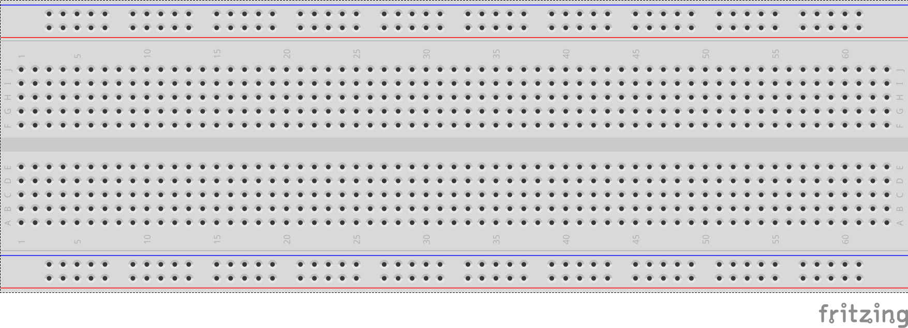
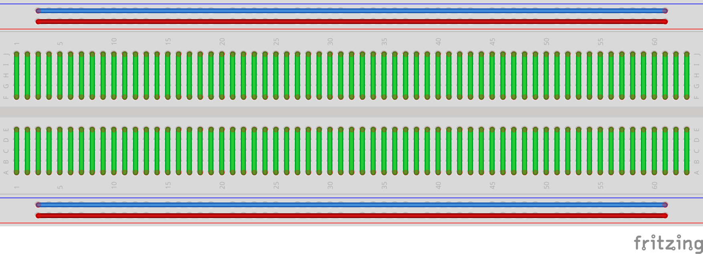

# getting starting with intro to circuits
hey look, things! now what?

## let's start with your breadboard

### breadboard
This is a breadboard. Notice all those holes? You can shove the legs of components in those holes to connect them together without any solder at all. Breadboards are pretty great, and they're a staple of electronics prototyping.

### breadboard connections
"How does shoving components into a breadboard connect them together?" you may (and should) ask. Well, all those holes are connected to each other internally in certain ways. Specifically, in these ways shown below.

An important thing to note: I've drawn red and blue lines running the whole way down the board on the sides. These are called the **power rails**. Normally, they are where you connect your voltage source and your voltage ground. **On some breadboards, the power rails disconnect in the middle of the board**. You should check to see if yours is connected or disconnected at the middle. Keep reading to find out how to check.

## your multimeter
Your multimeter will be your most valuable tool. It is called a multimeter because it is a meter of multiple things. We'll be using it for four things:

* continuity
* resistance
* voltage
* current

### setting up your multimeter